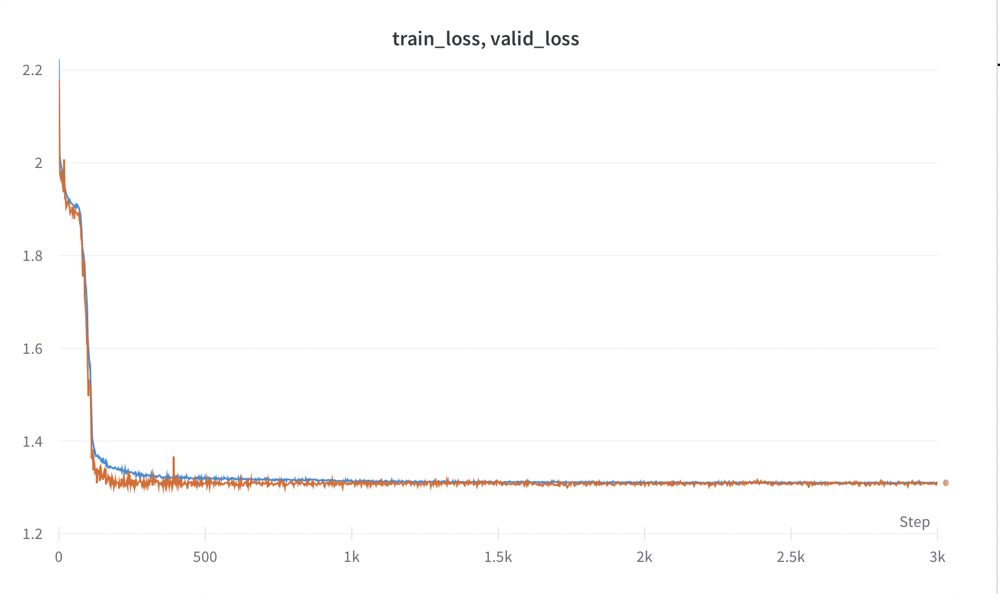
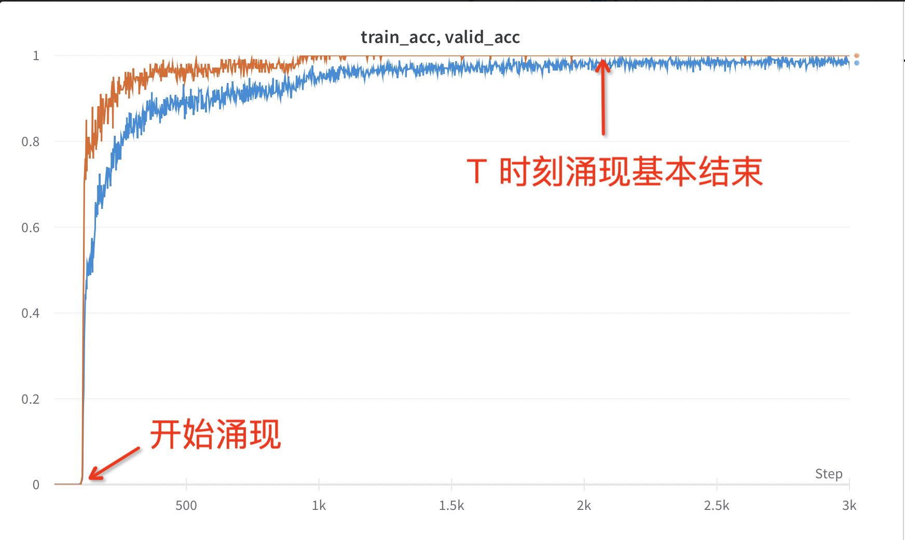

## Implementation of the Eight-digit Addition demo in [Compression to AGI]()

### Installation:
To get started with this project, follow the steps below:
```
git clone https://github.com/yulundu/compression.git
cd compression/
pip install -r requirements.txt
```

### Running the script:
Run the train.py script to replicate the results:
```
python train.py
```

### Results:
After running the above command, you should get curves similar to the ones shown in the blog post and below:
 

As a sanity check, we also provide a wandb log [here](https://wandb.ai/yulundu/compression_demo_dylan/runs/6rj97g8j):

We use [Weights And Biases](https://wandb.ai/) and [Loguru](https://github.com/Delgan/loguru) to draw the curves and log results. Feel free to take a look at the numbers and data in the logs.


